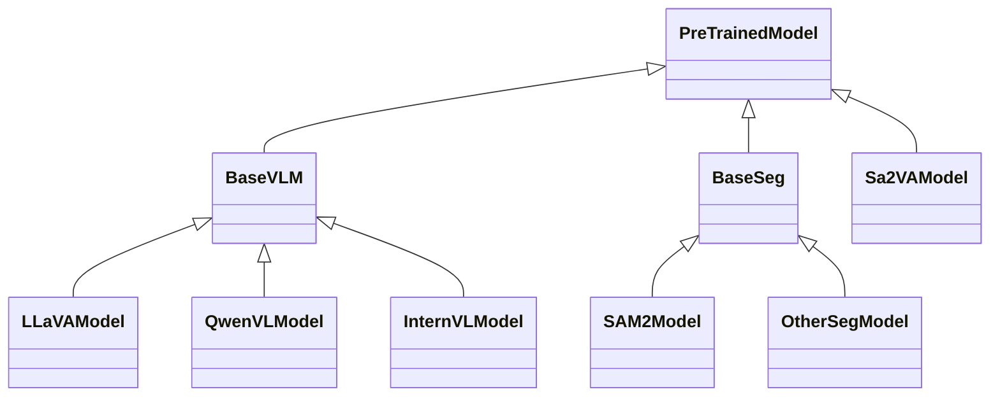
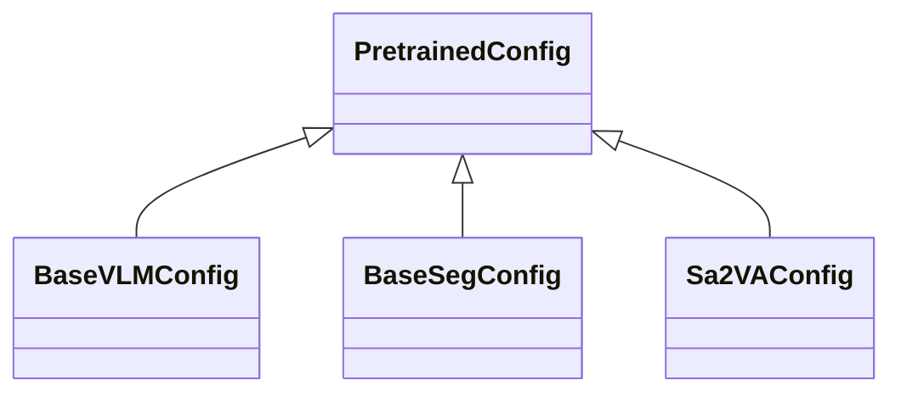
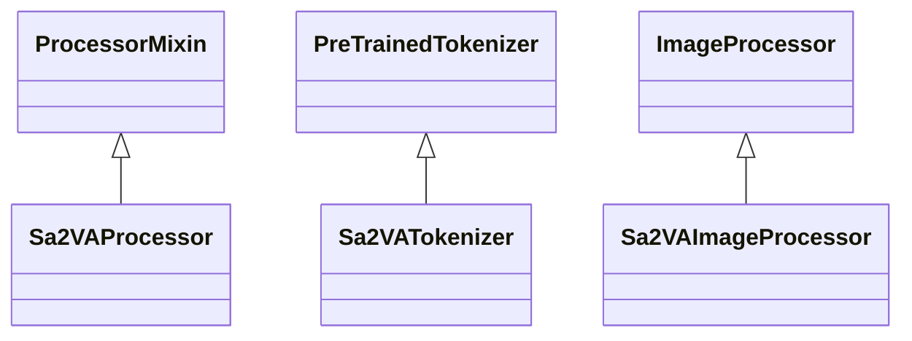

# Sa2VA Transformers 集成设计

## 1. 集成概述

Sa2VA 与 Transformers 库的集成主要涉及以下几个方面：
1. 继承 Transformers 的核心类
2. 遵循 Transformers 的设计模式
3. 支持 HuggingFace 模型库
4. 实现标准的模型接口

## 2. 核心类继承关系

### 2.1 模型类继承



### 2.2 配置类继承



### 2.3 处理器类继承



## 3. 关键集成点

### 3.1 模型加载

```python
# 使用 AutoModel 加载模型
from transformers import AutoModel

model = AutoModel.from_pretrained(
    "ByteDance/Sa2VA-1B",
    trust_remote_code=True
)

# 使用 AutoConfig 加载配置
from transformers import AutoConfig

config = AutoConfig.from_pretrained(
    "ByteDance/Sa2VA-1B",
    trust_remote_code=True
)

# 使用 AutoProcessor 加载处理器
from transformers import AutoProcessor

processor = AutoProcessor.from_pretrained(
    "ByteDance/Sa2VA-1B",
    trust_remote_code=True
)
```

### 3.2 模型保存

```python
# 保存模型
model.save_pretrained("path/to/save")

# 保存配置
config.save_pretrained("path/to/save")

# 保存处理器
processor.save_pretrained("path/to/save")
```

### 3.3 模型注册

```python
# 注册模型到 Transformers
from transformers import AutoConfig, AutoModel

AutoConfig.register("sa2va", Sa2VAConfig)
AutoModel.register(Sa2VAConfig, Sa2VAModel)

# 注册处理器
from transformers import AutoProcessor

AutoProcessor.register(Sa2VAConfig, Sa2VAProcessor)
```

## 4. 标准接口实现

### 4.1 模型接口

1. **必需方法**
   ```python
   def forward(self, *args, **kwargs)
   def get_input_embeddings(self)
   def set_input_embeddings(self, value)
   def get_output_embeddings(self)
   def set_output_embeddings(self, value)
   ```

2. **可选方法**
   ```python
   def prepare_inputs_for_generation(self, *args, **kwargs)
   def _reorder_cache(self, past, beam_idx)
   def get_encoder(self)
   def get_decoder(self)
   ```

### 4.2 配置接口

1. **必需属性**
   ```python
   model_type
   ```

2. **必需方法**
   ```python
   def to_dict(self)
   def to_json_string(self)
   def from_dict(cls, config_dict, **kwargs)
   def from_json_file(cls, json_file, **kwargs)
   ```

### 4.3 处理器接口

1. **必需方法**
   ```python
   def __call__(self, *args, **kwargs)
   def save_pretrained(self, save_directory)
   def from_pretrained(cls, pretrained_model_name_or_path, **kwargs)
   ```

## 5. 模型输出格式

### 5.1 标准输出

```python
from transformers.modeling_outputs import BaseModelOutput

class Sa2VAOutput(BaseModelOutput):
    """
    Sa2VA 模型输出类
    """
    def __init__(
        self,
        last_hidden_state,
        hidden_states=None,
        attentions=None,
        vlm_outputs=None,
        seg_outputs=None,
        masks=None
    ):
        super().__init__(
            last_hidden_state=last_hidden_state,
            hidden_states=hidden_states,
            attentions=attentions
        )
        self.vlm_outputs = vlm_outputs
        self.seg_outputs = seg_outputs
        self.masks = masks
```

### 5.2 输出处理

```python
def process_outputs(self, outputs):
    """
    处理模型输出
    
    Args:
        outputs: 模型输出
        
    Returns:
        dict: 处理后的输出
    """
    return {
        "text": self.tokenizer.decode(outputs.last_hidden_state),
        "masks": outputs.masks,
        "vlm_features": outputs.vlm_outputs,
        "seg_features": outputs.seg_outputs
    }
```

## 6. 工具集成

### 6.1 模型工具

1. **模型转换**
   ```python
   def convert_to_transformers_format(self):
       """转换模型到 Transformers 格式"""
       pass
   
   def convert_from_transformers_format(self):
       """从 Transformers 格式转换"""
       pass
   ```

2. **模型量化**
   ```python
   def quantize_model(self, quantization_config):
       """模型量化"""
       pass
   
   def dequantize_model(self):
       """模型反量化"""
       pass
   ```

### 6.2 训练工具

1. **训练器集成**
   ```python
   from transformers import Trainer, TrainingArguments
   
   trainer = Trainer(
       model=model,
       args=training_args,
       train_dataset=train_dataset,
       eval_dataset=eval_dataset
   )
   ```

2. **评估器集成**
   ```python
   from transformers import Trainer, TrainingArguments
   
   trainer = Trainer(
       model=model,
       args=training_args,
       eval_dataset=eval_dataset
   )
   ```

## 7. 最佳实践

### 7.1 模型实现

1. **继承关系**
   - 正确继承 Transformers 基类
   - 实现所有必需方法
   - 保持接口一致性

2. **配置管理**
   - 使用标准的配置类
   - 提供合理的默认值
   - 支持配置序列化

3. **处理器实现**
   - 实现标准的处理器接口
   - 支持批处理
   - 处理各种输入格式

### 7.2 模型使用

1. **模型加载**
   - 使用 AutoModel 加载
   - 提供模型检查点
   - 支持远程代码

2. **模型保存**
   - 保存完整模型
   - 保存配置信息
   - 保存处理器

3. **模型推理**
   - 使用标准接口
   - 处理各种输入
   - 提供标准输出

### 7.3 性能优化

1. **内存优化**
   - 使用模型量化
   - 实现梯度检查点
   - 优化批处理

2. **计算优化**
   - 使用 Flash Attention
   - 实现模型并行
   - 优化数据加载

3. **推理优化**
   - 实现模型缓存
   - 优化数据预处理
   - 支持模型蒸馏

## 8. 注意事项

1. **兼容性**
   - 确保与 Transformers 版本兼容
   - 处理版本差异
   - 提供迁移指南

2. **安全性**
   - 验证输入数据
   - 处理异常情况
   - 提供错误信息

3. **可维护性**
   - 提供详细文档
   - 添加单元测试
   - 遵循代码规范

4. **可扩展性**
   - 支持新模型添加
   - 支持新功能扩展
   - 保持接口稳定 